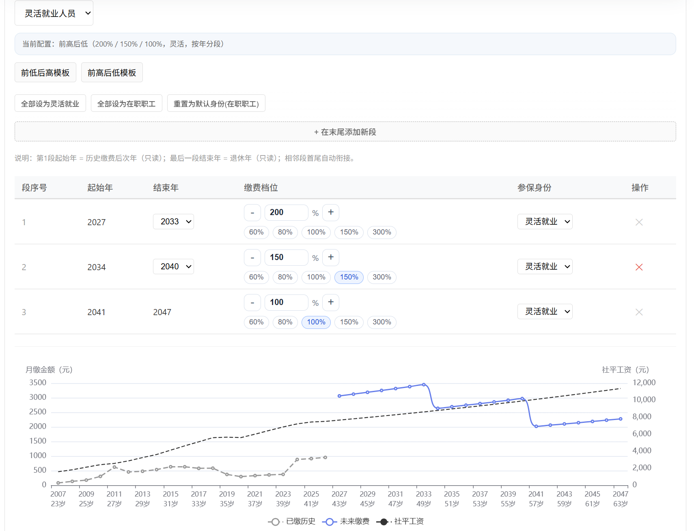
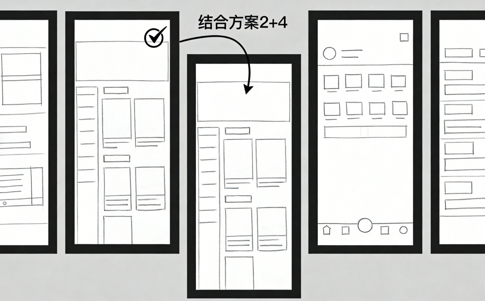
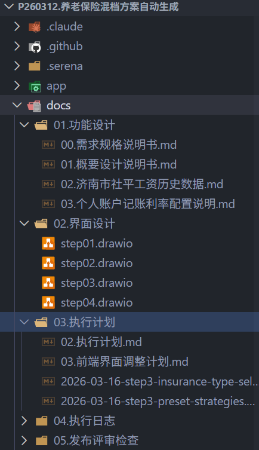
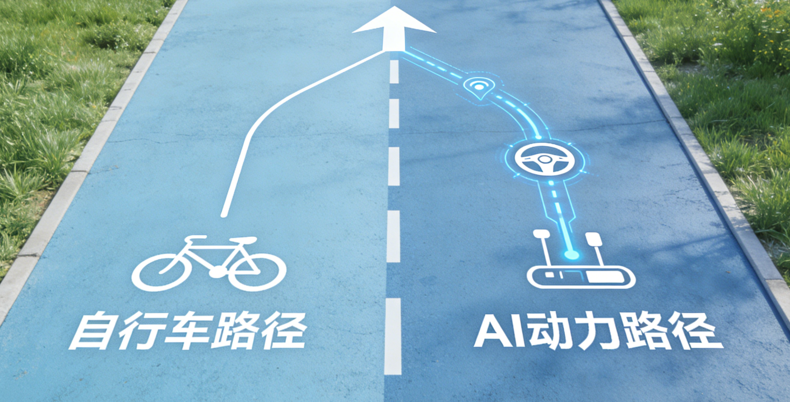

# 我以为 2 天能做完，结果做了 8 天：AI 编程，不只是“写得更快”，而是从“骑自行车”变成了“开汽车”

> 发布时间：2026-03-24 · 分类：技术方案

## 一、一个让我彻底改观的数字

上个月，我用 AI 做了一个养老金计算器。

项目启动前，我给自己的预期是：2 天搞定。  
真正做完，花了 8 天。

乍一看，这像是变慢了。

但如果按传统方式做，这件事通常不是“一个人 2 天”能解决的。它更像一个小团队的活：业务专家、产品经理、前端工程师、UX 设计师、测试人员，一起协作两周，才比较稳。

所以真正该比较的，不是：

**2 天 vs 8 天**

而是：

**一个人 8 天，vs 一个团队 2 周。**

更重要的是，这 8 天让我改掉了一个原来的看法。

很多人理解的 AI 编程，还是“让 AI 写点代码，我再复制粘贴”。  
但这次项目做下来，我越来越确定一件事：

**AI 编程的变化，不只是代码生成变快了，而是人的角色变了。**

如果非要用一个比喻来形容，我觉得最贴切的是：

**它已经从“骑自行车”，变成了“开汽车”。**

## 二、这个项目到底做了什么

先说项目本身。

如果你是灵活就业人员，或者认真研究过养老保险，你大概率听过“缴费档次”这个概念。

简单说，就是你每个月缴费时，可以按社平工资的 60% 到 300% 选择缴费基数。档次越高，当下交得越多，退休后通常领得也越多。

但关键在于：

**你不需要每年都选同一个档次。**

今年手头紧，可以先按 60% 缴；  
明年收入上来了，再拉到 200%。

这种“不同年份选不同档次”的做法，就是混档。

问题也就来了。

缴费期一拉就是几十年，241 个档次可选（60% 到 300%，每 1% 一档），到底怎么组合，才能既少花钱，又让退休后的收益更优？

这件事，靠手算几乎不可能。

所以我做了一个工具：  
输入基本信息和预算，它自动帮你算出更优方案。

这不是一个 demo，而是一个真实可用的工具。最终交付是单个 HTML 文件，双击就能在浏览器里运行，不依赖服务器。

技术栈也很直接：

- TypeScript
- Vite
- ECharts
- 纯前端计算，所有逻辑都在浏览器端完成

最后的代码规模大约 3000 行（含注释和测试），30 次 git 提交，48 个测试用例。

听起来不算小。

但真正让我有冲击感的，是这 8 天里，我几乎没有手写过一行代码。

## 三、AI 最先打掉的，不是代码量，而是试错成本

我现在越来越觉得，AI 编程最先改变的，不是“写代码的速度”，而是“试错的成本”。

传统开发里，试错是贵的。

你想试一个新设计，往往意味着：

先开会。  
产品、设计、前端一起讨论。  
讨论完，前端回去做。  
两天后发现方向不对，或者体验不对。  
那就继续开会、继续返工、继续协调。

而且你还会面对一个很现实的问题：

别人已经花了两天把东西做出来了，你现在说“推翻重来”，哪怕大家嘴上不说，心里也会有成本感。

但用 AI 做开发，这个成本会被压得很低。

我可以直接让 AI 一次给出 5 套方案。  
而且每一套都不是“嘴上说说”，而是代码、测试、文档一起出来。

我看完之后，可以直接选一套。  
也可以直接说：

“方案 2 的结构不错，但我想要方案 4 的交互。”  
“把这两个合一下，再给我一版。”

AI 不会有情绪，也不会介意“刚写好的东西又被推翻”。  
它只会继续往下改。

很多时候，你泡一杯茶回来，新方案已经在那儿了。

这里我有一个很具体的体感。

项目最后几天，我在调整 Step4 页面里的“退休后累计收益对比”功能。我的原始要求是：对比多个养老金方案，而且每个方案都要展示多个年度的数据。

但 AI 第一次理解错了。  
它做成了“单个方案的多年对比”，不是“多个方案并列对比”。

更麻烦的是，那版 UX 也不好看，交互也不顺。

如果按传统方式，我大概率会把这件事拉回“重新讲需求、重新排设计、重新等实现”的流程里。

但那次我只是装了一个 `ui-ux-pro-max` skill，让 AI 重新设计，再来回讨论几个细节。

不到半小时，这个问题就解决了。

这件事最打动我的，不是“AI 改得快”，而是：

**你终于敢试了。**

因为你不再总想着：

“万一这个方案不行怎么办？”  
“万一试错会浪费两天怎么办？”

当试错成本低到可以忽略，很多过去不敢走的路，今天都可以先走一遍再说。

## 四、AI 编程的核心能力，已经慢慢从“写代码”变成“管上下文”

如果你问我：AI 编程和传统编程最大的区别是什么？

我的答案是：

**核心能力变了。**

传统编程里，最重要的能力是“写代码”。

你得懂语法、懂算法、懂框架、懂设计模式。  
你的主要输出，体现在代码本身。

但到了 AI 编程阶段，越来越重要的能力，其实更像：

**管理上下文。**

也就是，你能不能让 AI 充分理解：

- 这个项目到底要解决什么问题
- 有哪些业务规则不能碰
- 要遵循什么技术标准
- 任务应该按什么顺序推进
- 边界条件和验证标准是什么

这次项目里，我专门搭了一套完整的文档体系：

- `CLAUDE.md`：记录技术方案、目录结构、设计原则
- 需求规格说明书：约 300 行，定义功能和计算规则
- 概要设计说明书：记录架构、模块划分、核心数据结构
- 执行计划：明确先做什么、后做什么

这些文档不是写给领导看的“过程材料”，而是给 AI 的指令系统。

有了这套文档，AI 才不是“盲写代码”，而是知道这个项目的目标是什么、用什么技术栈、代码该怎么组织、测试该怎么写、遇到边界情况怎么处理。

而且这些文档，并不一定都要你从零写。

我这次更像是在这样协作：

1. 我先给 AI 一个方向
2. AI 补成初稿
3. 我审阅并指出问题
4. 来回讨论几轮，再定稿

这本身就是协作。

更关键的是，这个过程非常值。

项目刚开始时，我花了大概 1 小时做需求分析，最后产出了一份 300 行左右的需求规格说明书。

就在这个过程中，AI 反过来问了我很多问题：

- “回本”怎么定义？只算个人缴费，还是个人和单位缴费一起算？
- 退休后养老金逐年上涨，要不要纳入计算？
- 延迟退休政策，要不要接进去？

有些问题，如果没有它追问，我自己未必会在一开始就想到。

更关键的是，在审需求文档时，我发现了一个真正会把项目带偏的问题：

文档里很多地方默认是“按年”计算，  
但真实世界里，养老保险很多动作其实是按月发生的。

一个人完全可能这个月还是在职职工，下个月就变成灵活就业。  
如果你只按“年”去算，精度根本不够。

所以我后来把整套设计从“年度”改成了“月度”：

- 缴费按月
- 身份按月
- 档次按月
- 预算按月

这一个改动，就牵动了需求文档里七八处核心定义。

如果这件事是在代码写完以后才发现，那基本就不是“修一下”，而是推翻重来。

所以现在回头看，那 1 小时需求分析，根本不是成本，而是节省返工的投资。

还有一个细节让我印象很深。

在讨论需求时，AI 提醒我：

“个人账户是有记账利率的，近几年大约在 1% 到 3% 之间。如果不把这部分利息算进去，整个计算结果就是错的。”

这个点我之前完全没想到。

那一刻我很明确地感觉到：

**AI 不只是补代码，它还在帮你补盲区。**

## 五、AI 很强，但最后兜底的人还是你

当然，AI 不是万能的。

这个项目里，最难的其实不是技术，而是一个更根本的问题：

**我怎么确认结果是对的？**

我不是养老保险专家。  
也没有业务专家坐在旁边给我兜底。

AI 生成的算法看起来很合理，但“看起来合理”和“真的正确”，是两回事。

所以我最后采用了一个笨但有效的方法：反向推演。

我去社保局官方网站，用他们的养老金测算工具，设计了 10 组不同的输入参数，拿到了 10 组官方结果。

然后我把这些结果喂给 AI，问它：

“这些是标准答案。你能不能反推，官网大概用了什么算法？”

AI 分析之后，给出了官方算法的推测。  
接着我又让它对比：我们的算法和官方算法，到底差在哪儿？

结果比我预想的还要有意思。

AI 发现了几处关键差异：

- 官方网站对社平工资增长率的假设偏高，可能按 5% 算，但近几年实际更接近 2% 到 3%
- 官方没有考虑延迟退休规则
- 官方起始社平基数用的是国家平均数，而不是地区平均数
- 还有一些细节差异

换句话说，不是“我们离官方差一点”，而是：

**在若干关键假设上，我们的算法反而更接近现实。**

这件事也让我更确定一件事：

AI 可以帮你写代码、做计算、生成文档。  
但它不能替你承担最后那一步判断。

你还是得知道：

- 什么结果值得怀疑
- 什么地方必须验证
- 什么差异只是实现细节
- 什么差异会直接改变结论

这部分能力，今天依然只能由人来兜底。

AI 也许能帮你跑得更快，  
但最后决定“这条路能不能走”的，还是你。

## 六、为什么我说：它像从骑自行车变成了开汽车

现在回到开头那个比喻。

为什么我觉得 AI 编程像“从骑自行车变成开汽车”？

因为两者最大的区别，不在于“有没有在移动”，而在于：

**谁在提供动力，谁在控制方向。**

骑自行车的时候，你既要控制方向，也要自己输出动力。  
你得一脚一脚踩，车才会往前走。

开汽车的时候不一样。  
你主要负责方向，动力交给发动机。

你踩油门，车就走。  
你转方向盘，车就转。

AI 编程越来越像后者。

你的主要工作，不再是自己一行一行把代码敲出来，而是：

- 告诉 AI 要做什么
- 定义做到什么程度才算完成
- 在分岔路口上决定往哪边走
- 在结果出来之后判断要不要继续

但这里有一个很关键的问题：

**方向从来不是天然明确的。**

就拿这次项目来说，我的目的地是明确的：  
做一个养老金方案对比工具。

但路径一点也不明确：

- 是做简单表格，还是做可视化图表？
- 是只支持单方案计算，还是支持智能搜索最优方案？
- 是做成普通网页应用，还是做成单 HTML 文件？
- 界面应该长什么样？用户先看什么？后看什么？

这些问题，在产品真正被做出来之前，答案往往并不清楚。

所以我需要不断试：

试不同的设计。  
试不同的交互。  
试不同的信息组织方式。

有的方案看上去最稳，但体验无聊。  
有的方案起初没那么顺，但用户一用就明白。

以前，这种尝试很贵。  
现在，AI 把它变便宜了。

它提供的“动力”，让你能更频繁地转向：

- 新功能可以很快落地
- 测试和文档能同步补上
- 做到一半发现方向不对，也能及时打断重来

这就是我说的“开汽车感”。

你不再那么害怕绕路。  
因为绕一圈的代价，已经不像以前那么高了。

## 七、如果你也想试 AI 编程，我的 5 个建议

这 8 天下来，如果让我给刚开始尝试 AI 编程的人几点建议，我会说这 5 条。

### 1. 不要跳过需求分析

很多人一上来就想：直接让 AI 写代码，不就行了？

这通常是最容易返工的起点。

AI 的确能快速产出，但前提是，你得先把问题说清楚，把边界条件想清楚。

需求分析不是拖慢速度。  
很多时候，它是在替你挡住后面更大的返工。

我这次花 1 小时做需求分析，最后至少省下了 10 小时的重做成本。

### 2. 学会用 Skill，而不是只会“提问”

Skill 的价值，不只是省事，而是把别人的方法论和工具链直接接到你手里。

这次项目里，我用了几个很有帮助的 skill：

- `brainstorm`
- `ui-ux-pro-max`
- `webapp-testing`

它们分别帮我处理需求与架构、界面体验、页面验证。

站在这些现成能力包上往前走，速度会比自己从零摸索快很多。

### 3. 把文档体系搭起来

如果说 AI 编程最核心的能力是“上下文管理”，那文档体系就是它的地基。

你至少得让 AI 清楚几件事：

- 项目要解决什么问题
- 有哪些规则和约束
- 代码应该怎么组织
- 出错时该怎么判断和处理

这些文档不是额外负担。  
它们就是你和 AI 高效协作的共同语言。

### 4. 一定要保留验证意识

AI 很强，但它还是会：

- 理解错需求
- 生成有 bug 的实现
- 漏掉关键边界条件

所以你不能把“会生成”误当成“已经正确”。

代码要审。  
结果要验。  
边界情况要测。

最后的兜底能力，今天依然是人的核心价值。

### 5. 大胆试错

AI 编程最迷人的地方，不是“第一次就做对”，而是“做错了也能很快再来一次”。

所以别太怕试错。

多试几个方案，真的比在脑子里空想更快。  
因为很多问题，只有东西跑起来之后你才看得清。

以前你不敢多试，是因为每次转向都很贵。  
现在不是了。

## 八、这不是程序员贬值，而是角色升级

写到这里，很多人都会自然冒出一个担心：

AI 这么强，程序员是不是要被取代了？

我的看法正好相反。

我更愿意把这件事理解成：

**不是“AI 取代程序员”，而是“程序员从执行者，变成了项目指挥官”。**

以前，程序员的价值更多体现在“把代码写出来”。

你懂语法、懂算法、懂框架，这些当然依然重要。  
但现在，真正拉开差距的能力，正在往另一边移动：

- 你能不能把问题想清楚
- 你能不能把需求讲明白
- 你能不能做出取舍
- 你能不能验证结果
- 你能不能把控方向

这其实是一个更有创造性、也更有杠杆的角色。

就像从手工制造走到工业化生产，人的角色不再是“亲手打磨每一个零件”，而是去操作机器、控制质量、优化流程。

这不是技能贬值。  
这是角色升级。

回到这次 8 天的项目。

如果没有 AI，我一个人很难把它做到这个程度。  
但有了 AI，我不仅把它做出来了，而且做出来的质量，并不输给一个小团队的协作产出。

这就是我现在理解的 AI 编程。

它不是让你少做事。  
它是在把你从“亲自踩踏板的人”，变成“决定车往哪开的人”。

---

如果你也在尝试 AI 编程，这篇建议先收藏。

等你真正开始做项目、开始写需求、开始反复试方案的时候，很多地方会重新对上。

如果你身边也有人还把 AI 编程理解成“让 AI 帮忙补几行代码”，也可以把这篇转给他。

后面我还会继续分享更多 AI 编程的实战案例，包括需求分析、上下文管理、技能体系和验证方法。

想继续看的，欢迎关注我。

---

**标签**：#AI编程 #养老金计算器 #项目复盘 #效率工具
